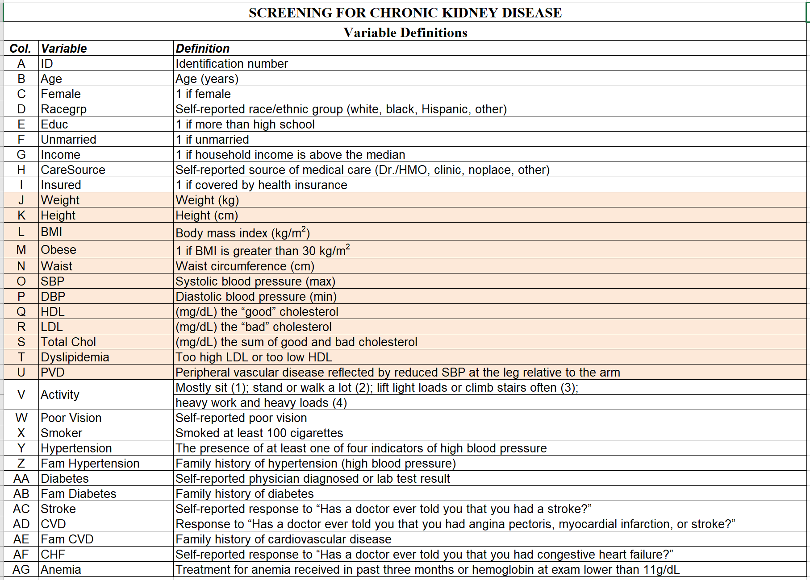

## Chronic Kidney Disease prediction

### Table of contents
* [Introduction](#introduction)
* [Problem Statement](#problem-statement)
* [Technologies](#technologies)
* [Data](#data)
* [Algorithms](#algorithms)
* [Data Pre-processing](#data-pre-processing)
* [Exploratory Data Analysis](#exploratory-data-analysis)
* [Approach](#approach)
* [Evaluation Metrics](#evaluation-metrics)
* [Results](#results)
* [Conclusion](#conclusion)

### Introduction
* Chronic Kideny Disease (CKD) is a progressive condition that results in significant morbidity and mortality. Because of the important role the kidneys play in maintaining homeostasis, CKD can affect almost every body system. Early recognition and intervention are essential to slowing disease progression. 

### Problem Statement
* The purpose of this case is to create an easy-to-use screening tool to identify patients at risk for CKD for the doctor to identify at early stage, so that the patients with a   high enough probability of having CKD can be tested. 

### Data Source
* The dataset was obtained from Darden Business Publishing - University of Virginia. 

### Technologies
* R
* RShiny
* Heroku

### Data
* Dataset consists of 8819 patients data in csv format 
* Target variable:  'CKD'
* Predictors     :  32
* Dataset consists of 32 predictors, which consists of 10 continuous variables, and 22 categorical variables.
* The variables description: 

### Algorithms
* Logistic Regression

### Data Pre-processing
* There were 2819 rows with no prediction if the patient has Chronic Kidney Disease or not. Since, it wont help in training the model, I have removed these rows for the further analysis. 
* The missing values in the data were handled by removing rows if they have missing values in any of the significant predictors especially because this is healthcare data, and it is important to build the model based on truth rather than the imputed data. This is the important learning for me in my Healthcare Analytics course.

### Exploratory Data Analysis 
* Chi-square test of categorical variables with the target variable 'CKD' to find the significant variables. 
* Perfomed Correlation between the continuous variables to remove highly correlated variables  
 *'Total Chol' is the sum of 'low HDL' and 'high LDL', and they are highly correlated. Hence, I removed 'Total Chol'
* t-test (Welch Two Sample t-test) between the continuous variable and the target variable to include only the strong predictors

### Approach
* Split the dataset with including only those variables that are statistically significant into 75% training and 25% test data. 
* By using 'vif' (variance inflation factor), removed the multi-collinearity among the predictors and found the variables that needs to be included in the final model.
* Built Logistic regression model on the training data

### Evaluation Metrics
* It is important that we predict the True positive so instead of measuring accuracy, I am using Recall as the evaluation metric so we can reduce the 'false negative'. 

### Results 
* Predicted with a Recall of 94%. 
* Age, Hispanic race, HDL levels, hypertension, CVD and Diabetes are the one of major factors leading to CKD.
* Found that being 'Female' increases the odds of getting 'Chronic Kidney Disease' by 40%. 
* 'Diabetes', and 'Hypertension' are very significant predictors. Having 'Diabetes' increases the odds of 'Chronic Kidney Disease' by 139%, and 'Hypertension' increases the odds  of 'Chronic Kidney Disease' by 111%. 

### Conclusion
* The importance of predicting the 'Chronic Kidney Disease' is very crucial and the modelling on this data helped me identify the predictors that the doctor initially collects from the patient, and only testing those which has high probability of getting the 'Chronic Kidney Disease' is needed. I learned the importance of building the screening tool and went ahead to build it. The screening tool with the model built in R Statistical programming language is then deployled using RShiny, and Heroku. 
